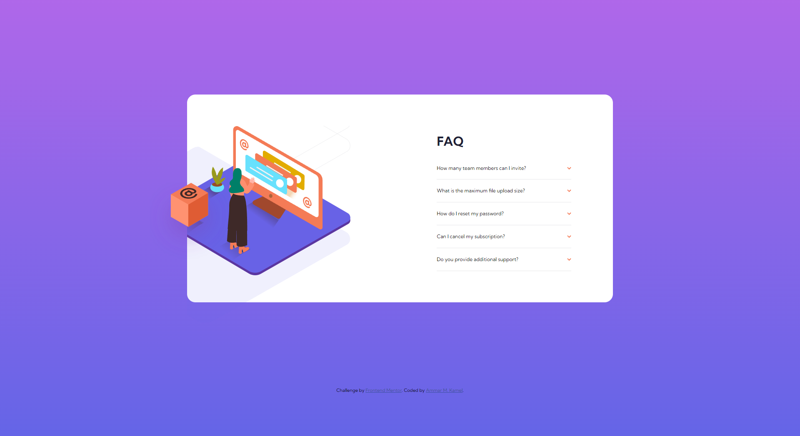

# Frontend Mentor - FAQ accordion card solution

This is a solution to the [FAQ accordion card challenge on Frontend Mentor](https://www.frontendmentor.io/challenges/faq-accordion-card-XlyjD0Oam). Frontend Mentor challenges help you improve your coding skills by building realistic projects. 

## Table of contents

- [Overview](#overview)
- [Screenshot](#screenshot)
- [Links](#links)
- [Built with](#built-with)
- [What I Learned](#what-i-learned)
- [Author](#author)

## Overview

- This is a quite challenging HTML, CSS and JS Project.
- It is a FAQ that consists of mutliple accordtions, but the challengeing part was getting the images right.
- I managed to complete this challenge without using JS.

## Screenshot



## Links

- Solution URL: [GitHub Repo](https://github.com/AmmarMKamel/faq-accordion-card)
- Live Site URL: [FAQ Accordion Card](https://ammarmkamel.github.io/faq-accordion-card/)

## Built with

- Semantic HTML5 markup
- CSS custom properties
- Flexbox
- Mobile-first workflow

## What I learned

- I made use of the ``` <input type="checkbox"> ``` and its ```:checked``` 
pseudo class to implement the accordion items transition.

## Author

- GitHub - [AmmarMKamel](https://github.com/AmmarMKamel)
- Frontend Mentor - [@AmmarMKamel](https://www.frontendmentor.io/profile/AmmarMKamel)
- Linkedin - [Ammar Kamel](https://www.linkedin.com/in/ammar-kamel-872422246/)